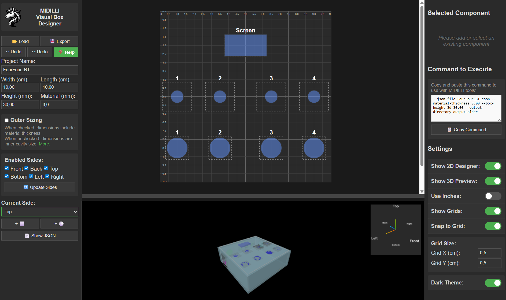

# MIDILLI Visual Box Designer

[](https://opensource.org/licenses/Apache-2.0)
[](https://github.com/MIDILLI-Tech/visual-box-designer)
[](https://midilli.tech)

A **free, open-source, web-based 3D box designer** for laser engravers, CNC routers, and 3D printers. Design custom boxes, cabinets, and furniture panels with precise component placement (drill holes, cutouts, labels) in an intuitive 2D/3D interface. Export your designs as JSON files to be used as input for free MIDILLI tools and to create production ready files.



[Start Using Online](https://midilli.tech/visual-box-designer/)

[Read Online Manual](https://midilli.tech/help-and-support/manuals/manuals-free-tools/midilli-visual-box-designer/)

---

## 🎯 What is This?

**MIDILLI Visual Box Designer** is a browser-based CAD tool that lets you:

- **Design box-shaped projects** (cabinets, enclosures, furniture panels, etc.)
- **Add components** like drill holes, cutouts, mounting points, and text labels
- **Visualize in 2D and 3D** with real-time preview
- **Export to JSON** format compatible with MIDILLI production tools

**No installation required** – runs entirely in your browser!

---

## 🚀 Key Features

### Design Tools
- ✅ **6-sided box design** (Front, Back, Top, Bottom, Left, Right)
- ✅ **Flexible sizing** – Outer or inner dimensions with material thickness compensation
- ✅ **Dual unit support** – Centimeters or inches
- ✅ **Component types**:
  - Circular holes (drill diameter)
  - Rectangular cutouts (width × length)
  - Visible outlines (for recesses/labels)
  - Rotatable text labels with custom font sizes
- ✅ **Grid snapping** – Precise alignment (adjustable grid size)
- ✅ **Drag & drop** – Move components visually or with arrow keys

### Interface
- ✅ **2D canvas** with coordinate grid and pan/zoom
- ✅ **Interactive 3D preview** with orbit controls and orientation cube
- ✅ **Dark/Light themes**
- ✅ **Responsive panels** – Resizable 2D/3D split view

### Export & Integration
- ✅ **JSON export** – Standard format for MIDILLI tools
- ✅ **Load/Save projects** – Continue your work anytime
- ✅ **Command generator** – Copy-paste ready commands for production tools

---

## 🛠️ What Can You Make With Exported JSON?

The JSON file serves as input for **three free MIDILLI production tools**, each optimized for different manufacturing methods:

### 1. 🔥 [MIDILLI SVG Generator for Laser Engraving Machines](https://midilli.tech/product/midilli-svg-generator-for-laser-engraving-machines/)
Create **SVG vector files** for laser cutters. Perfect for:
- Wood, acrylic, cardboard cutting
- Precise edge cuts and engravings
- Fast prototyping

**Use case:** Design a custom electronics enclosure with mounting holes and ventilation cutouts.

---

### 2. ⚙️ [MIDILLI G-Code Generator for CNC Routers](https://midilli.tech/product/midilli-g-code-generator-for-cnc-routers/)
Generate **G-Code toolpaths** for CNC machines. Features:
- Multi-depth cutting (recesses, pockets, through-cuts)
- Tool path optimization
- Configurable speeds and feeds

**Use case:** Mill a cabinet panel with recessed LED mounting holes and cable routing channels.

---

### 3. 🖨️ [MIDILLI STL Generator for 3D Printers](https://midilli.tech/product/midilli-stl-generator-for-3d-printers/)
Export **STL 3D models** for additive manufacturing. Supports:
- Negative space (holes and cutouts)
- Text embossing/debossing
- Multi-part assemblies

**Use case:** 3D print a modular storage box with snap-fit connectors and labeled compartments.

---

**All tools are free to download:** [MIDILLI Free Tools & Utilities](https://midilli.tech/download/free-tools-and-utilities/)

---

## 📦 Getting Started

### Option 1: Use Online (Recommended)
Visit **[midilli.tech/visual-box-designer](https://midilli.tech/visual-box-designer/)**

### Option 2: Run Locally

1. **Clone the repository:**
   ```bash
   git clone https://github.com/MIDILLI-Tech/visual-box-designer.git
   cd visual-box-designer
   ```

2. **Serve with a local HTTP server:**
   
   **Python:**
   ```bash
   python -m http.server 8000
   ```
   
   **Node.js:**
   ```bash
   npx http-server -p 8000
   ```
   
   **VS Code Live Server:**
   - Install "Live Server" extension
   - Right-click `index.html` → **Open with Live Server**

3. **Open in browser:**
   ```
   http://localhost:8000/index.html
   ```

**Note:** `file://` protocol is **not supported** due to ES modules requiring HTTP.

---

## 🎓 Quick Tutorial

### 1. Set Project Dimensions
- **Width/Length/Height** – Box size in cm or inches
- **Material Thickness** – Panel thickness in mm or inches
- **Outer Sizing** checkbox:
  - ✅ **Checked:** Dimensions include material (external measurements)
  - ❌ **Unchecked:** Dimensions are internal cavity size

### 2. Enable Sides
- Check/uncheck **Front, Back, Top, Bottom, Left, Right**
- Click **🔄 Update Sides** to apply changes

### 3. Add Components
- Select a side from **Current Side** dropdown
- Click **+ ⬜** (rectangle) or **+ ⚪** (circle) to add components
- **Drag** to reposition or use **arrow keys**
- Select component → Edit properties in right panel:
  - **Text** – Label (rotates with component)
  - **X/Y Position** – Location in cm/inches
  - **Drill Diameter** or **Width/Length** – Actual cut size
  - **Visible Diameter/Width/Length** – Outline for reference/recesses
  - **Rotation** – Angle in degrees (clockwise)

### 4. Preview & Export
- **2D Canvas** – Grid-based design view (pan: right-click/middle mouse, zoom: scroll)
- **3D Preview** – Rotate with mouse, click orientation cube to snap views
- **📄 Show JSON** – Preview data structure
- **💾 Export JSON** – Download file for MIDILLI tools
- Copy **Command to Execute** from right panel
- Use the recommended command and run the MIDILLI tool you needed. Feel free to tweak advanced settings.

---

## ⌨️ Keyboard Shortcuts

| Shortcut | Action |
|----------|--------|
| `Shift + R` | Add rectangle component |
| `Shift + C` | Add circle component |
| `R` | Rotate selected component by 45° |
| `↑ ↓ ← →` | Move selected component |
| `Delete` | Delete selected component |
| `Enter` | Apply changes (when editing properties) |
| `Ctrl + O` | Load JSON file |
| `Ctrl + S` | Export JSON file |
| `Ctrl + Z` | Undo last action |
| `Ctrl + Y` `Ctrl + Shift + Z` | Redo last undone action |

---

## 🧩 Technology Stack

- **Three.js** – 3D rendering and visualization
- **SVG** – 2D canvas drawing
- **Vanilla JavaScript** – No frameworks, lightweight and fast
- **ES Modules** – Modern import system
- **OrbitControls** – Intuitive 3D camera navigation

**Total size:** ~500KB (including Three.js library)

---

## 📐 Technical Details

### Coordinate Systems
Each side has its own 2D coordinate system with origin (0,0) at **top-left corner**:

- **Front/Back:** X = Width, Y = Height
- **Top/Bottom:** X = Width, Y = Length
- **Left/Right:** X = Height, Y = Length

**Learn more:** [Understanding 2D Coordinate Systems in MIDILLI Tools](https://midilli.tech/help-and-support/manuals/manuals-free-tools/understanding-2d-coordinate-systems-in-midilli-tools/)

### Data Storage
- All internal measurements stored in **centimeters**
- Material thickness and box height in **millimeters**
- JSON export preserves cm units for tool compatibility
- Display units (cm/inches) are UI-only conversions

### Component Properties
```json
{
  "call_name": "USB Port",
  "silkscreen_font_size": 12,
  "location_x": 5.0,
  "location_y": 3.0,
  "drill_width": 1.2,
  "drill_length": 0.8,
  "visible_width": 1.5,
  "visible_length": 1.0,
  "rotation": 45
}
```

---

## 🎨 Customization

### Themes
Toggle between **Dark** and **Light** themes in settings.

### Grid Settings
- **Grid Size:** Adjustable X/Y spacing (0.1–10 units)
- **Snap to Grid:** Auto-align components to grid intersections
- **Show Grids:** Toggle grid visibility

---

## 🤝 Contributing

We welcome contributions! Here's how you can help:

### Reporting Issues
- Use [GitHub Issues](https://github.com/MIDILLI-Tech/visual-box-designer/issues)
- Include browser version, steps to reproduce, and screenshots

### Feature Requests
- Check [existing issues](https://github.com/MIDILLI-Tech/visual-box-designer/issues?q=is%3Aissue+is%3Aopen+label%3Aenhancement)
- Explain use case and expected behavior

### Pull Requests
1. Fork the repository
2. Create feature branch (`git checkout -b feature/amazing-feature`)
3. Commit changes (`git commit -m 'Add amazing feature'`)
4. Push to branch (`git push origin feature/amazing-feature`)
5. Open Pull Request

**Code style:**
- Use ES6+ features
- Comment complex logic
- Follow existing naming conventions
- Test in Chrome, Firefox, and Edge

---

## 📄 License

This project is licensed under the **Apache License 2.0** – see [LICENSE](LICENSE) file for details.

**In summary, you can:**
- ✅ Use commercially
- ✅ Modify and distribute
- ✅ Use privately
- ✅ Use in patent claims

**You must:**
- 📄 Include original license and copyright notice
- 📝 State significant changes so that we can also integrate your awesome addition
- 🔒 Preserve trademarks and notices

---

## 🆘 Support & Resources

### Documentation

- 📖 [Read Online Manual](https://midilli.tech/help-and-support/manuals/manuals-free-tools/midilli-visual-box-designer/)
<!-- - 🎥 [Video Tutorials](https://midilli.tech/help-and-support/video-tutorials/) (coming soon) -->
<!-- - 💬 [FAQ](https://midilli.tech/help-and-support/faq/) -->

### Community
- 💻 [MIDILLI Tech Website](https://midilli.tech)
- 📧 [Contact Support](https://midilli.tech/help-and-support/)
- 🐛 [Report Bug](https://github.com/MIDILLI-Tech/visual-box-designer/issues)

### Related Tools
- [MIDILLI Free Tools Download Page](https://midilli.tech/download/free-tools-and-utilities/)
- [MIDILLI SVG Generator Documentation](https://midilli.tech/product/midilli-svg-generator-for-laser-engraving-machines/)
- [MIDILLI G-Code Generator Documentation](https://midilli.tech/product/midilli-g-code-generator-for-cnc-routers/)
- [MIDILLI STL Generator Documentation](https://midilli.tech/product/midilli-stl-generator-for-3d-printers/)

---

## 🏆 Credits

**Developed by:** [MIDILLI Tech](https://midilli.tech)  
**Version:**  (November 05, 2025)  

**Built with:**
- [Three.js](https://threejs.org/) – 3D rendering library ([MIT License](https://github.com/mrdoob/three.js/blob/dev/LICENSE))
- [OrbitControls](https://threejs.org/docs/#examples/en/controls/OrbitControls) – Part of Three.js examples ([MIT License](https://github.com/mrdoob/three.js/blob/dev/LICENSE))
- Vanilla JavaScript – No additional frameworks
- Inspiration from open-source CAD tools

---

## 🔮 Roadmap

### Upcoming Features
- [ ] SVG import for custom shapes
- [ ] Component alignment (for faster design)

---

## ⚠️ Known Issues

- **Browser compatibility:** Requires modern browser with ES6 modules support (Chrome 61+, Firefox 60+, Edge 79+)
- **Large projects:** 100+ components may cause slowdown on older hardware
- **Mobile:** Touch gestures limited (best viewed on desktop/tablet)

See [Issues](https://github.com/MIDILLI-Tech/visual-box-designer/issues) for full list.

---

## 📊 Project Status


**Active development** | **Production ready** | **Open to contributions**

---

## 💡 Example Use Cases

### 1. Electronics Enclosure
Design a Raspberry Pi case with:
- USB/HDMI cutouts
- Ventilation holes
- Mounting screw positions
- GPIO access opening
- Label text for ports

### 2. Modular Furniture
Create shelving units with:
- Adjustable shelf holes
- Cable management channels
- Dowel alignment markers
- Assembly instructions engraved

### 3. Storage Boxes
Build organizers with:
- Compartment dividers
- Snap-fit connectors
- Stackable alignment pins
- Labeled compartments

### 4. Workshop Tools
Design jigs and fixtures:
- Drill guide templates
- Router templates
- Alignment fixtures
- Calibration tools

---

## Acknowledgments

Special thanks to:
- [Three.js](https://threejs.org/) community for excellent documentation

---

**Made with ❤️ by MIDILLI Tech**  

---

**Star ⭐ this repo if you find it useful!**

[Website](https://midilli.tech) • [Documentation](https://midilli.tech/help-and-support/manuals/) • [Download Compatible Tools](https://midilli.tech/download/free-tools-and-utilities/) • [Report Issue](https://github.com/MIDILLI-Tech/visual-box-designer/issues)
